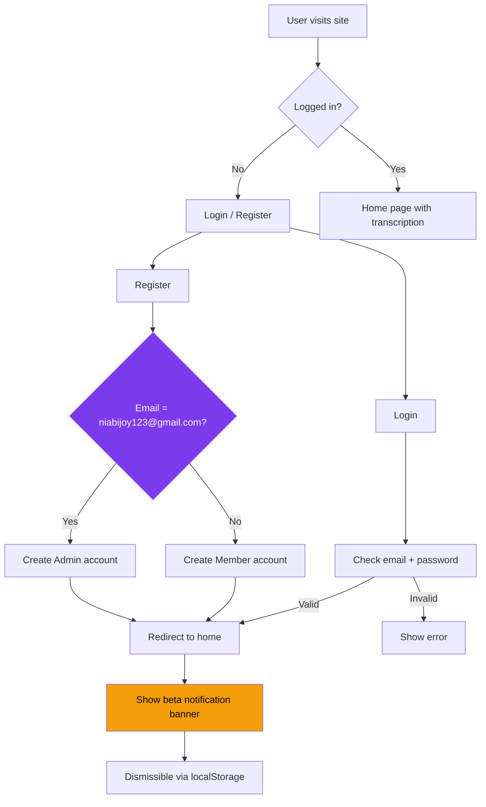

# Auth System Simplification Plan

## Overview
Strip the authentication system down to a bare-minimum email+password auth with a hardcoded admin. Remove all email verification, IP-based locking, and unlock request functionality. Add a beta-version notification banner.

---

## Changes to Each File

### 1. `auth_models.py` — Remove unnecessary models

| Change | Detail |
|--------|--------|
| Remove `VerificationToken` model | Entire class removed |
| Remove `UnlockRequest` model | Entire class removed |
| Remove `LoginLog` model | Entire class removed (or kept if user wants logging) |
| Simplify `User` model | Remove `is_verified`, `is_locked`, `ip_address` columns. Keep `is_admin`. Remove `logs` and `unlock_requests` relationships. |

**Note:** Since we're removing columns, the existing `instance/app.db` must be deleted so SQLAlchemy recreates tables with the new schema.

### 2. `auth_routes.py` — Drastically simplify routes

| Route | Current Behavior | New Behavior |
|-------|-----------------|--------------|
| `GET /register` | Renders register form | Same, but remove "first user is admin" message |
| `POST /register` | Creates user as unverified, sends verification email, first user = admin | If email == `niabijoy123@gmail.com` → `is_admin=True`, else `is_admin=False`. No verification email sent. User is immediately active. |
| `GET /login` | Renders login form with unlock link | Same, but remove unlock link |
| `POST /login` | Checks verification, locked status, IP lock | Only checks email + password. No verification, no IP lock checks. |
| `/verify-email-notice` | Shows "check email" page | **REMOVED** |
| `/verify/<token>` | Verifies email token | **REMOVED** |
| `/request-unlock` | Unlock request form | **REMOVED** |
| `/unlock-request-sent` | Confirmation page | **REMOVED** |
| `/admin/unlock-requests` | List unlock requests | **REMOVED** |
| `/admin/unlock/<id>/approve` | Approve unlock | **REMOVED** |
| `/admin/unlock/<id>/deny` | Deny unlock | **REMOVED** |
| `/admin/users/<id>/toggle-admin` | Toggle admin role | **REMOVED** (admin is hardcoded to one email) |
| `/admin/dashboard` | Shows locked/unverified stats | Simplify — remove locked, unverified, unlock request stats |
| `/admin/users` | Shows verified/locked/IP columns | Simplify columns |
| Rate limit handler | Returns login template | Keep as is |

### 3. `auth_utils.py` — Remove email/unlock helpers

| Change | Detail |
|--------|--------|
| Remove `send_verification_email()` | No longer needed |
| Remove `send_unlock_notification()` | No longer needed |
| Keep `log_action()` | Still useful for audit logging |
| Keep `admin_required` decorator | Still needed |
| Keep `login_required` decorator | Still needed |

### 4. `templates/base.html` — Add beta notification banner

Add a dismissible notification banner at the top of the page that displays:

> **Beta Version** — It is just a beta version. We keep working on it. We will add some new features for this site. Let us know if you want anything new for our site.

The notification should:
- Appear on every page
- Be dismissible (click to close, stored in `localStorage` so it doesn't reappear)

### 5. `templates/login.html` — Remove unlock link

Remove the `<hr>` and "Locked out? Request Unlock" section at the bottom.

### 6. `templates/register.html` — Remove "first user" message

Remove the `<p>` tag that says "The very first user becomes the permanent admin."

### 7. `templates/admin/dashboard.html` — Simplify stats

| Card | Action |
|------|--------|
| Total Users | Keep |
| Locked | **REMOVED** |
| Unverified | **REMOVED** |
| Unlock Requests | **REMOVED** |
| Locked accounts alert banner | **REMOVED** |
| Recent Activity log | Keep |

### 8. `templates/admin/users.html` — Simplify table columns

| Column | Action |
|--------|--------|
| Email | Keep |
| Role | Keep (Admin / Member) |
| Verified | **REMOVED** |
| Status (Locked/Active) | **REMOVED** |
| IP Address | **REMOVED** |
| Registered | Keep |
| Actions | Keep only if current user != this user AND this user is admin... Actually, since admin is hardcoded to one email, remove the "Make Admin/Remove Admin" button entirely. |

### 9. Templates to delete

- `templates/verification_success.html`
- `templates/verification_failed.html`
- `templates/unlock_request.html`
- `templates/unlock_request_sent.html`
- `templates/verify_email.html`
- `templates/admin/unlock_requests.html`

### 10. `app.py` — Remove unused config

| Change | Detail |
|--------|--------|
| Remove `ADMIN_CONTACT_EMAIL` config | No longer needed since we no longer send notifications |

### 11. Database

Delete `instance/app.db` so the simplified schema is built fresh.

---

## Flow (After Simplification)

```
Register
  │
  ├─ Email: niabijoy123@gmail.com  →  Admin role
  └─ Any other email               →  Member role
       │
       └─ No email verification needed
       └─ User is immediately active
       
Login
  │
  ├─ Enter email + password
  ├─ Credentials valid?  →  Log in (no checks for lock/verify/IP)
  └─ Invalid?            →  Show error
       
Every page load
  └─ Beta notification banner (dismissible via localStorage)
```

## Mermaid Diagram


