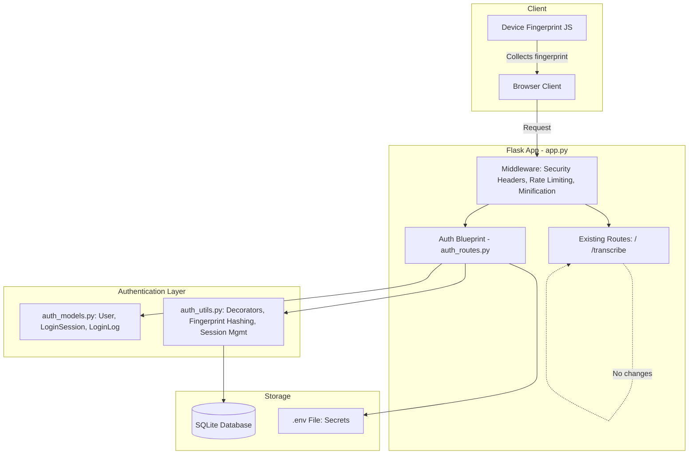
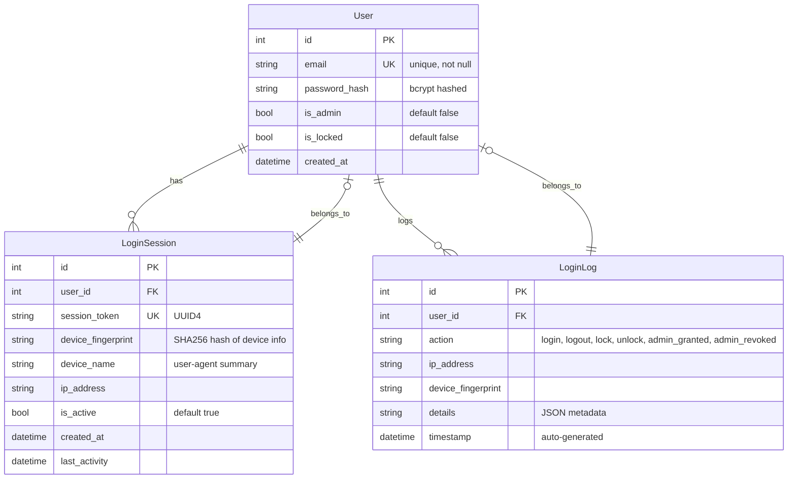
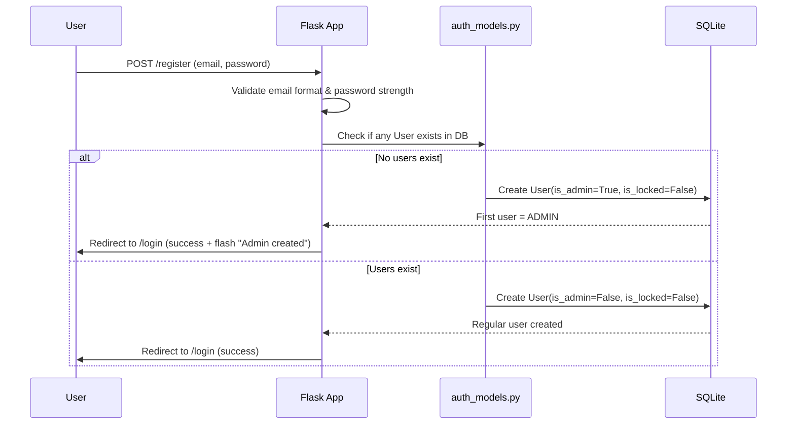
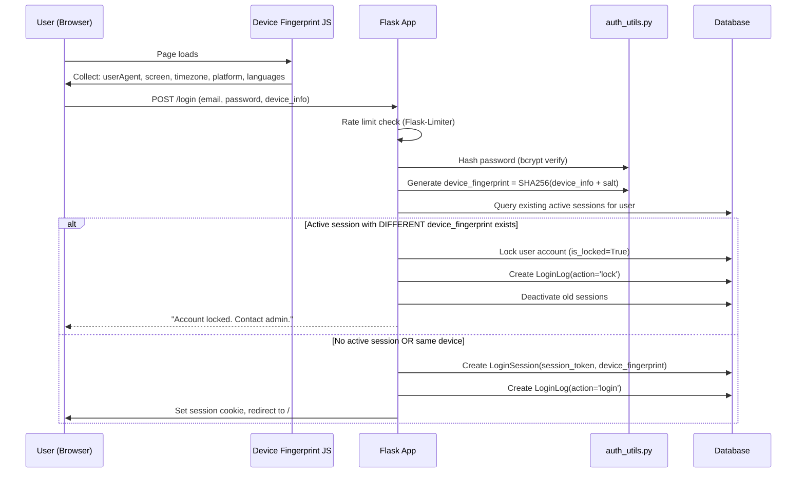
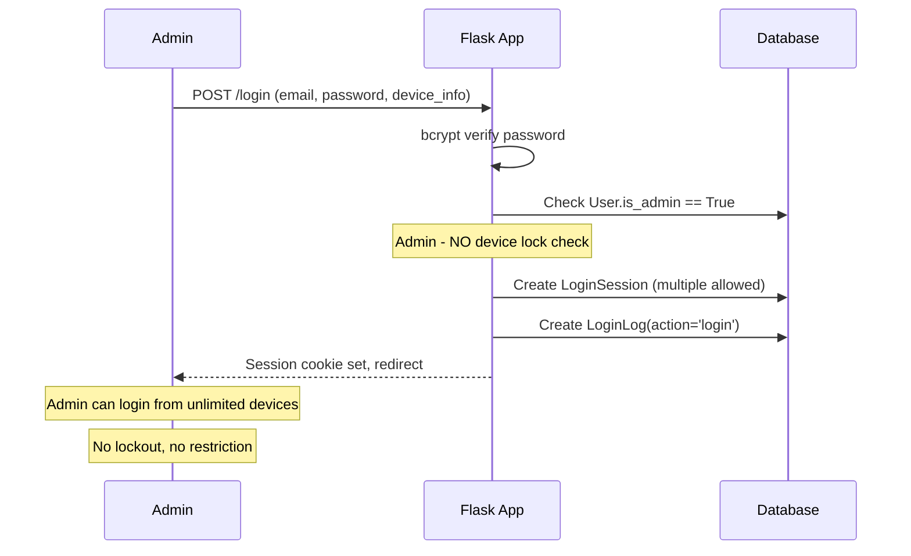

# Secure Login & Authentication System — Architecture Plan

## 1. Overview

Add a complete authentication and authorization layer to the existing Flask audio transcription app without modifying any existing code. The system uses a Flask Blueprint pattern to keep auth logic separate, and hooks into the main app via imports and blueprint registration only.

---

## 2. System Architecture



---

## 3. Database Schema



---

## 4. Authentication Flow

### 4.1 Registration Flow



### 4.2 Login Flow (Regular User)



### 4.3 Login Flow (Admin User)



---

## 5. File Structure

```
d:/Local LLM/
├── app.py                          # EXISTING - NO CHANGES EXCEPT ADDITIONS
├── auth_models.py                  # NEW - SQLAlchemy models
├── auth_routes.py                  # NEW - Flask Blueprint for auth
├── auth_utils.py                  # NEW - Decorators, helpers
├── requirements.txt               # MODIFIED - Add dependencies
├── .env                           # MODIFIED - Add secret key, DB URI
├── templates/
│   ├── index.html                 # EXISTING - Add nav links (minimal change)
│   ├── base.html                  # NEW - Base template with nav
│   ├── login.html                 # NEW - Login form
│   ├── register.html              # NEW - Registration form
│   └── admin/
│       ├── dashboard.html         # NEW - Admin dashboard
│       ├── users.html             # NEW - User management
│       └── logs.html              # NEW - Activity logs
└── static/                        # Created if needed
    └── admin.css                  # NEW - Admin panel styles (optional)
```

---

## 6. Route Map

| Method | Path | Auth | Description |
|--------|------|------|-------------|
| GET | / | Public | Existing transcription page |
| POST | /transcribe | Public | Existing transcription API |
| GET | /login | Public | Login page |
| POST | /login | Public | Login action + rate limited |
| GET | /register | Public | Registration page |
| POST | /register | Public | Registration action + rate limited |
| GET | /logout | Login required | Logout + session cleanup |
| GET | /admin/dashboard | Admin only | Admin panel overview |
| GET | /admin/users | Admin only | User management table |
| POST | /admin/users/<id>/unlock | Admin only | Unlock a locked user |
| POST | /admin/users/<id>/toggle-admin | Admin only | Grant/revoke admin role |
| GET | /admin/logs | Admin only | Login activity logs |

---

## 7. Security Measures

### 7.1 Password Security
- **bcrypt** via `Flask-Bcrypt` with default rounds (12)
- Minimum password length: 8 characters
- Passwords never logged or exposed

### 7.2 Rate Limiting (Flask-Limiter)
- Login: `5 per minute` per IP address
- Registration: `3 per hour` per IP address
- Uses in-memory storage (default)

### 7.3 Security Headers
Added via `@app.after_request` middleware:
```
X-Content-Type-Options: nosniff
X-Frame-Options: DENY
X-XSS-Protection: 1; mode=block
Strict-Transport-Security: max-age=31536000; includeSubDomains
Content-Security-Policy: default-src 'self'; script-src 'self'; style-src 'self' 'unsafe-inline' fonts.googleapis.com; font-src fonts.gstatic.com
```

### 7.4 Session Security
- `SESSION_COOKIE_HTTPONLY = True`
- `SESSION_COOKIE_SAMESITE = 'Lax'`
- `SESSION_COOKIE_SECURE = True` (when HTTPS enabled)
- `PERMANENT_SESSION_LIFETIME = 24 hours`

### 7.5 CSRF Protection
- Flask-WTF CSRF protection on all forms
- Token auto-generated and validated server-side

---

## 8. Device Fingerprinting

The client-side JavaScript collects the following for fingerprinting:
- `navigator.userAgent`
- `screen.width x screen.height`
- `screen.colorDepth`
- `navigator.platform`
- `navigator.language`
- `Intl.DateTimeFormat().resolvedOptions().timeZone`
- `navigator.hardwareConcurrency`

The server hashes this JSON string with a server-side salt using `SHA-256` to produce the device fingerprint stored in the database.

---

## 9. Template Minification

After rendering, all HTML templates are minified using `htmlmin` via an `@app.after_request` middleware. This:
- Strips unnecessary whitespace
- Removes HTML comments
- Reduces bandwidth usage
- Does not affect Jinja2 rendering or dynamic content

---

## 10. Admin Dashboard Features

- **Dashboard Overview**: Total users, locked accounts count, active sessions count, recent logins
- **User Management**: Table with email, role, status (locked/unlocked), actions (unlock, toggle admin)
- **Login Logs**: Paginated table showing timestamp, user, action, IP, device fingerprint (last 8 chars)
- **Lock Notifications**: Prominent banner when new accounts need unlocking (via session flash messages)

---

## 11. Performance Considerations

- **SQLite with connection pooling** via SQLAlchemy (handles 100 concurrent users easily)
- **Indexed columns**: `user.id`, `user.email`, `loginsession.user_id`, `loginsession.is_active`, `loginlog.user_id`, `loginlog.timestamp`
- **Template caching** via Flask's built-in template caching
- **Session storage**: Flask-Login uses signed cookies (client-side), no DB hit for session lookup
- **Rate limiting**: In-memory, no DB overhead

---

## 12. Implementation Order

1. Update `requirements.txt` and `.env` with new dependencies and secrets
2. Create `auth_models.py` with SQLAlchemy models
3. Create `auth_utils.py` with decorators and helper functions
4. Create `auth_routes.py` with the Flask Blueprint
5. Create templates: `base.html`, `login.html`, `register.html`
6. Create admin templates: `admin/dashboard.html`, `admin/users.html`, `admin/logs.html`
7. Add auth integration to `app.py` (imports, config, blueprint registration, middleware)
8. Add device fingerprinting to existing `index.html`
9. Configure HTML minification

---

## 13. Constraints & Guarantees

| Requirement | Implementation |
|------------|---------------|
| No changes to existing app.py code | All additions are new import lines, config lines, and blueprint registration at end of file |
| Admin auto-assign | First registered user gets `is_admin=True` |
| Admin multi-device | Skip device check when `user.is_admin == True` |
| User device locking | Compare `device_fingerprint` on each login; lock on mismatch |
| Admin notification | Flash messages + LoginLog entries visible on admin dashboard |
| bcrypt hashing | Flask-Bcrypt with 12 rounds |
| .env secrets | `SECRET_KEY` and `DATABASE_URL` stored in `.env` only |
| Rate limiting | Flask-Limiter with in-memory backend |
| Security headers | `@app.after_request` middleware |
| HTML minification | `htmlmin` post-render middleware |
| 100 concurrent users | SQLite + SQLAlchemy connection pooling handles this easily |
