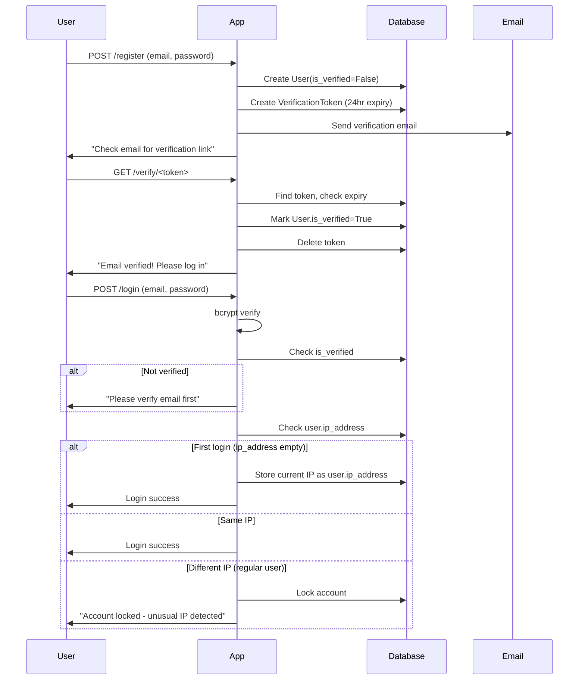

# Authentication System v2 — Migration Plan

## Summary of Changes

Replace device-fingerprint locking with **IP-based locking**, add **email verification**, and add an **unlock request workflow**.

---

## 1. Database Model Changes (`auth_models.py`)

| Model | Change |
|-------|--------|
| **User** | Add `is_verified` (bool), `ip_address` (string - stores first login IP) |
| **LoginSession** | Keep minimal — used for Flask-Login session tracking only |
| **LoginLog** | Remove `device_fingerprint` column |
| **VerificationToken** | **NEW** — `id`, `user_id` (FK), `token` (string, unique), `expires_at` (datetime) |
| **UnlockRequest** | **NEW** — `id`, `user_id` (FK), `status` (enum: pending/approved/denied), `message` (text), `created_at` (datetime), `admin_response` (text) |

### User model updates:
```python
class User(UserMixin, db.Model):
    # ... existing fields ...
    is_verified = db.Column(db.Boolean, default=False, nullable=False)
    ip_address = db.Column(db.String(45), default="")  # first login IP
```

---

## 2. Authentication Flow



---

## 3. Route Map (Updated)

| Method | Path | Purpose | Auth |
|--------|------|---------|------|
| GET/POST | `/register` | Register + send verification email | Public |
| GET | `/verify/<token>` | Verify email | Public |
| GET/POST | `/login` | Login with IP check | Public |
| GET | `/logout` | Logout | Login required |
| GET | `/request-unlock` | Unlock request form | Public |
| POST | `/request-unlock` | Submit unlock request | Public |
| GET | `/unlock-request-sent` | Confirmation page | Public |
| GET | `/admin/dashboard` | Admin stats | Admin |
| GET | `/admin/users` | User management | Admin |
| POST | `/admin/users/<id>/unlock` | Unlock user | Admin |
| POST | `/admin/users/<id>/toggle-admin` | Toggle admin role | Admin |
| GET | `/admin/unlock-requests` | View unlock requests | Admin |
| POST | `/admin/unlock/<request_id>/approve` | Approve unlock | Admin |
| POST | `/admin/unlock/<request_id>/deny` | Deny unlock | Admin |
| GET | `/admin/logs` | Login activity logs | Admin |

---

## 4. Files to Modify

| File | Action |
|------|--------|
| `auth_models.py` | **REWRITE** — add VerificationToken, UnlockRequest; update User; remove device_fingerprint from LoginLog |
| `auth_utils.py` | **MODIFY** — remove `hash_device_fingerprint()`, remove `fingerprint` from `log_action()`, add `send_verification_email()` |
| `auth_routes.py` | **REWRITE** — all routes updated for new flow |
| `.env` | **MODIFY** — add email SMTP settings, admin contact email |
| `requirements.txt` | **MODIFY** — add `flask-mail` |
| `templates/login.html` | **MODIFY** — remove device fingerprint JS, add verification reminder |
| `templates/register.html` | **MODIFY** — update flash messages to mention email verification |
| `templates/base.html` | **NO CHANGE** — nav bar still works |
| `templates/index.html` | **NO CHANGE** |
| `templates/admin/dashboard.html` | **MODIFY** — add unlock requests count, remove active_sessions |
| `templates/admin/users.html` | **MODIFY** — show `is_verified` and `ip_address` columns |

## Files to Create

| File | Purpose |
|------|---------|
| `templates/verify_email.html` | Page shown after registration: "Check your email" |
| `templates/verification_success.html` | After clicking verify link: "Email verified!" |
| `templates/verification_expired.html` | If token expired: "Link expired, request new one" |
| `templates/unlock_request.html` | Form for locked user to request unlock |
| `templates/unlock_request_sent.html` | Confirmation after submitting unlock request |
| `templates/admin/unlock_requests.html` | Admin page: view pending unlock requests |

---

## 5. Email Configuration (`.env`)

```
MAIL_SERVER=smtp.gmail.com
MAIL_PORT=587
MAIL_USE_TLS=true
MAIL_USERNAME=your-email@gmail.com
MAIL_PASSWORD=your-app-password
MAIL_DEFAULT_SENDER=your-email@gmail.com
ADMIN_CONTACT_EMAIL=admin@example.com
```

---

## 6. Implementation Order

1. Update `requirements.txt` and `.env` with email settings
2. Rewrite `auth_models.py` — new models + updated fields
3. Update `auth_utils.py` — remove fingerprinting, add email helper
4. Rewrite `auth_routes.py` — all new routes and logic
5. Create/update templates (login, register, email verification pages, unlock pages, admin pages)
6. Delete old test db, run migration, test
