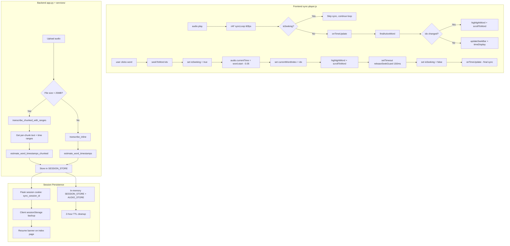

# BM Transcriber — Comprehensive Bugfix Plan

## Overview

This plan addresses five specific issues across the BM Transcriber application's sync transcript player pipeline: audio tracking and highlighting accuracy, click-to-seek reliability, chunked processing timestamp correctness, session persistence across navigation, and copy button functionality.

---

## 1. Audio Tracking & Highlighting

### Root Cause Analysis

The current `findActiveWord` function in [`static/js/sync-player.js`](../static/js/sync-player.js:259) uses a walking-pointer approach that only compares against `word.start` times, ignoring `word.end` times entirely. This causes two problems:

1. **Gap misalignment**: When `audio.currentTime` falls between `words[i].end` and `words[i+1].start` (i.e., a silence/pause gap), the algorithm stays on the current word correctly for forward playback, but the word's `end` time has already been exceeded without the visual state changing.

2. **Seek disruption**: When a programmatic seek occurs (via `seekToWord` or the seek bar), the `timeupdate` event fires asynchronously with the **previous** time before the seek completes. Since `findActiveWord` walks backward from `currentWordIndex` (which was just updated by `seekToWord`), the stale `timeupdate` can override the correct highlight with an incorrect one.

3. **Redundant sync loops**: Both the `timeupdate` event listener (line 150) and the `requestAnimationFrame` sync loop (line 182) call `onTimeUpdate`. This creates redundant updates and potential race conditions.

### Fix Strategy

**A) Add a seek-guard flag** to prevent `timeupdate` / rAF from overriding highlights during and immediately after a programmatic seek:

```javascript
// In sync-player.js state section
let isSeeking = false;         // true during programmatic seeks
let seekGuardTimeout = null;   // clears the guard after seek completes
```

**B) Fix `findActiveWord` to account for gap ranges:**

The algorithm should return the index of the word whose `[start, end)` range contains the current time. If the time falls in a gap between words, it should return the **previous** word (the one just spoken), not advance prematurely.

Modified logic:
```javascript
function findActiveWord(time) {
  if (!words.length) return -1;

  // If past the last word's end, return last word
  if (time >= words[words.length - 1].end) {
    return words.length - 1;
  }

  // If before the first word's start, return 0 (or -1 to indicate no word)
  if (time < words[0].start) {
    return 0;
  }

  // Walk forward: advance while time >= next word's start
  let pointer = Math.max(0, currentWordIndex);
  while (pointer < words.length - 1 && time >= words[pointer + 1].start) {
    pointer++;
  }
  // Walk backward: retreat while time < this word's start
  while (pointer > 0 && time < words[pointer].start) {
    pointer--;
  }

  return pointer;
}
```

The key insight: `currentWordIndex` is only used as a starting hint for the pointer walk. The walk forward/backward ensures correctness regardless of starting point. The seek-guard prevents the function from being called during a seek transition.

**C) Eliminate the redundant `timeupdate` handler** by moving all sync logic to the rAF loop only. The `timeupdate` event is unreliable (fires at ~4Hz, stops when tab is backgrounded). Replace it with a cleaner approach:

```javascript
function wireAudioEvents() {
  // Remove: audio.addEventListener("timeupdate", onTimeUpdate);

  // Only use rAF loop for sync (fires ~60fps, works in background)
  audio.addEventListener("play", function () {
    isPlaying = true;
    updatePlayButton();
    syncStatus.textContent = "▶ Playing";
    if (rafId) cancelAnimationFrame(rafId);
    rafId = requestAnimationFrame(syncLoop);
  });

  audio.addEventListener("pause", function () {
    isPlaying = false;
    updatePlayButton();
    syncStatus.textContent = "⏸ Paused";
    if (rafId) { cancelAnimationFrame(rafId); rafId = null; }
    onTimeUpdate(); // one final sync
  });
}

function syncLoop() {
  if (!audio.paused && !audio.ended && !isSeeking) {
    onTimeUpdate();
    rafId = requestAnimationFrame(syncLoop);
  } else if (!audio.paused && !audio.ended) {
    // Still playing but seeking — skip sync, continue loop
    rafId = requestAnimationFrame(syncLoop);
  }
}
```

**D) Improve `onTimeUpdate` with seek-guard:**

```javascript
function onTimeUpdate() {
  if (isSeeking) return; // Skip during programmatic seeks

  const currentTime = audio.currentTime;
  const idx = findActiveWord(currentTime);

  if (idx !== currentWordIndex) {
    currentWordIndex = idx;
    highlightWord(idx);
    scrollToWord(idx);
  }

  updateSeekBar();
  updateTimeDisplay();
}
```

**E) Update `seekToWord` to use the seek-guard:**

```javascript
function seekToWord(idx) {
  if (idx < 0 || idx >= words.length) return;

  isSeeking = true;
  if (seekGuardTimeout) clearTimeout(seekGuardTimeout);

  // Seek approximately 50ms before the word start for natural flow
  const seekTime = Math.max(0, words[idx].start - 0.05);

  if (!audioReady) {
    // Wait for audio metadata then seek
    var waitForReady = function () {
      if (audioReady) {
        audio.currentTime = seekTime;
        currentWordIndex = idx;
        highlightWord(idx);
        scrollToWord(idx, "instant");
        releaseSeekGuard();
        if (audio.paused) audio.play().catch(function () {});
      } else {
        setTimeout(waitForReady, 50);
      }
    };
    waitForReady();
    return;
  }

  audio.currentTime = seekTime;
  currentWordIndex = idx;
  highlightWord(idx);
  scrollToWord(idx, "instant");
  releaseSeekGuard();

  if (audio.paused) {
    audio.play().catch(function () {});
  }
}

function releaseSeekGuard() {
  seekGuardTimeout = setTimeout(function () {
    isSeeking = false;
    seekGuardTimeout = null;
    // Do a sync after releasing guard to correct any drift
    onTimeUpdate();
  }, 150); // 150ms should be enough for browser seek to complete
}
```

### Files Affected
- [`static/js/sync-player.js`](../static/js/sync-player.js) — Major rewrite of sync loop, seek logic, and word-finding

---

## 2. Click-to-Seek

### Root Cause Analysis

The existing `seekToWord` at [`static/js/sync-player.js:380`](../static/js/sync-player.js:380) has several issues:

1. **No seek-guard**: The programmatic `audio.currentTime = words[idx].start` triggers a `timeupdate` event with the **old** currentTime (before seek completes), which calls `onTimeUpdate()` → `findActiveWord()`. This can override `currentWordIndex` with a stale value.

2. **Browser time snapping**: Browsers often snap `audio.currentTime` to the nearest keyframe or sample boundary. Setting `audio.currentTime = 12.345` may result in `audio.currentTime` becoming `12.34` or `12.35`. If the snapped time falls before `words[idx].start`, `findActiveWord` will walk backward to the previous word.

3. **No natural flow offset**: Seeking to exactly `word.start` may miss the beginning of the word due to browser buffering. A small offset (50ms before the word start) provides a more natural experience.

4. **Initial state edge case**: When `currentWordIndex = -1` (initial state), the first click-to-seek sets `audio.currentTime` but the subsequent `timeupdate` finds `currentWordIndex = -1` and resets the pointer to 0 in `findActiveWord`, potentially walking to the wrong word.

### Fix Strategy

1. **Add seek-guard** (described in Fix 1) to prevent stale event interference.
2. **Seek to `max(0, word.start - 0.05)`** to account for browser snapping.
3. **After seek completes, force a sync** via `releaseSeekGuard` to correct any drift.
4. **Set `currentWordIndex` immediately** before the seek completes so highlight is instant.
5. **Treat seek bar clicks the same way** — use `seekToWord` logic for the seek bar as well, finding the nearest word and seeking to it.

### Files Affected
- [`static/js/sync-player.js`](../static/js/sync-player.js) — `seekToWord` function, `wireAudioEvents` seek bar handler

---

## 3. Chunked Processing & Timestamp Estimation

### Root Cause Analysis

In [`app.py`](../app.py:243), the `transcribe_chunked` function splits large audio into ~10MB chunks, transcribes each chunk separately, and returns text with segment markers:

```python
segments.append(f"[Segment {n}/{total_segments}]\n{text}")
# Returns: "[Segment 1/3]\ntext...\n\n[Segment 2/3]\ntext..."
```

This text is then passed to [`estimate_word_timestamps`](../services/timestamp_estimator.py:23) in `transcribe_with_words` (line 456):

```python
words = estimate_word_timestamps(text, duration)
```

**Three problems:**

1. **Segment markers become "words"**: `[Segment`, `1/3]` are treated as actual words by `estimate_word_timestamps`, polluting the transcript with artificial tokens that consume timestamp budget.

2. **Uniform distribution is wrong for chunks**: The estimator distributes all words uniformly across the **total** duration. But each chunk represents a specific time range. A chunk with 5 seconds of speech gets the same per-word time budget as a chunk with 30 seconds of speech, since the distribution is global.

3. **Chunk duration context is lost**: `transcribe_chunked` knows each chunk's start/end time (`pos` to `end`), but this information is discarded. The estimator receives only the concatenated text and total duration.

### Fix Strategy

**Option A (Recommended — Full fix): Modify `transcribe_chunked` to return structured per-chunk data, then enhance `transcribe_with_words` to compute timestamps per-chunk.**

1. **Create a new helper** `transcribe_chunked_with_duration` that returns `(segments_with_ranges, total_text_without_markers)`:

```python
def transcribe_chunked_with_ranges(
    api_key: str,
    model_slug: str,
    audio_bytes: bytes,
    audio_format: str = "mp3"
) -> tuple[list[dict], str]:
    """
    Transcribe large audio in chunks and return per-chunk data with time ranges.
    Returns:
      - segments: [{"index": 1, "text": "...", "start": 0.0, "end": 30.5}, ...]
      - full_text: concatenated text without segment markers
    """
    # ... similar to transcribe_chunked but returns structured data
```

2. **In `transcribe_with_words`, use per-chunk timestamps:**

```python
if len(audio_bytes) <= MAX_INLINE_BYTES:
    text = transcribe_inline(api_key, model_slug, audio_bytes, audio_format)
    words = estimate_word_timestamps(text, duration)
else:
    segments, full_text = transcribe_chunked_with_ranges(
        api_key, model_slug, audio_bytes, audio_format
    )
    # Compute timestamps per-chunk using each chunk's actual time range
    words = estimate_word_timestamps_chunked(full_text, segments, duration)
```

3. **Add `estimate_word_timestamps_chunked` in [`services/timestamp_estimator.py`](../services/timestamp_estimator.py):**

```python
def estimate_word_timestamps_chunked(
    full_text: str,
    segments: list[dict],  # [{text, start, end}, ...]
    total_duration: float
) -> list[WordTimestamp]:
    """
    Estimate word timestamps using per-chunk time ranges.
    Words in each chunk are distributed within that chunk's [start, end) range.
    """
    all_words: list[WordTimestamp] = []
    global_index = 0

    for seg in segments:
        chunk_duration = seg["end"] - seg["start"]
        if chunk_duration <= 0:
            continue

        tokens = seg["text"].strip().split()
        if not tokens:
            continue

        # Calculate weights within this chunk
        weights = []
        for token in tokens:
            w = float(len(token))
            if token.endswith(('.', '!', '?')):
                w *= 1.5
            elif token.endswith((',', ';', ':')):
                w *= 1.3
            weights.append(max(w, 1.0))

        total_weight = sum(weights)
        time_per_weight = chunk_duration / total_weight

        cumulative = 0.0
        for i, (token, weight) in enumerate(zip(tokens, weights)):
            start = seg["start"] + cumulative * time_per_weight
            end = seg["start"] + (cumulative + weight) * time_per_weight
            if i == len(tokens) - 1:
                end = seg["end"]

            all_words.append({
                "word": token,
                "start": round(start, 3),
                "end": round(end, 3),
                "index": global_index,
            })
            cumulative += weight
            global_index += 1

    return all_words
```

**Option B (Minimal fix — remove markers only):** Simply strip segment markers from the text before passing to the estimator:

```python
import re
# In transcribe_with_words, after getting text from transcribe_chunked:
clean_text = re.sub(r'\[Segment \d+/\d+\]\s*', '', text).strip()
words = estimate_word_timestamps(clean_text, duration)
```

**Recommendation**: Implement Option A for accuracy, with Option B as a fallback if chunk durations cannot be determined.

### Files Affected
- [`app.py`](../app.py) — Modify `transcribe_chunked` or add `transcribe_chunked_with_ranges`; update `transcribe_with_words`
- [`services/timestamp_estimator.py`](../services/timestamp_estimator.py) — Add `estimate_word_timestamps_chunked`

---

## 4. Session Persistence

### Root Cause Analysis

The application already implements session persistence using:
- **Server-side**: In-memory `SESSION_STORE` and `AUDIO_STORE` dicts with 1-hour TTL cleanup ([`app.py:66-86`](../app.py:66))
- **Client-side**: `sessionStorage` stores `sync_session_id`, `audio_url`, `text`, `duration` ([`sync-player.js:366-375`](../static/js/sync-player.js:366))
- **Index page**: Checks `sessionStorage` for resume banner ([`index.html:106-118`](../templates/index.html:106))

**Three remaining issues:**

1. **Server restart kills all sessions**: In-memory stores are lost on server restart. The client has a session ID in `sessionStorage` that points to nothing on the server. The resume banner appears, but clicking it leads to an error page.

2. **No session recovery**: When the player page loads and the session doesn't exist on the server (`SESSION_STORE.get(sync_session_id)` returns `None`), it renders an error instead of attempting to recover. The `init()` function in `sync-player.js` fetches `/api/session-transcriptions/${syncSessionId}` which returns 404.

3. **Cleanup is too aggressive**: The cleanup runs every hour and removes ALL expired sessions at once. If a user takes longer than an hour, their session is silently deleted.

### Fix Strategy

**A) Extend server-side TTL and make cleanup lazier:**

In [`app.py`](../app.py):
```python
SESSION_TTL = 7200  # Increased from 3600 to 2 hours
```

Also modify `_cleanup_stale_sessions` to only clean up sessions that are truly ancient (e.g., > 24 hours old) if the store is getting too large. Keep the 2-hour TTL for normal cleanup but add a soft-delete approach:

```python
SESSION_TTL = 7200  # 2 hours
SESSION_HARD_TTL = 86400  # 24 hours (hard cleanup for memory management)
MAX_SESSION_STORE_SIZE = 200  # max entries before forced cleanup

def _cleanup_stale_sessions():
    global _last_session_cleanup
    now = time.time()
    
    # Throttled: only run cleanup every SESSION_TTL seconds
    if now - _last_session_cleanup < SESSION_TTL:
        return
    _last_session_cleanup = now
    
    # Soft cleanup: remove sessions older than SESSION_TTL
    stale = [sid for sid, data in AUDIO_STORE.items()
             if now - data.get("_timestamp", 0) > SESSION_TTL]
    
    # Hard cleanup: if store is too large, remove oldest beyond SESSION_HARD_TTL
    if len(AUDIO_STORE) > MAX_SESSION_STORE_SIZE:
        hard_stale = [sid for sid, data in AUDIO_STORE.items()
                      if now - data.get("_timestamp", 0) > SESSION_HARD_TTL]
        stale = list(set(stale + hard_stale))
    
    for sid in stale:
        AUDIO_STORE.pop(sid, None)
        SESSION_STORE.pop(sid, None)
    if stale:
        print(f"[cleanup] Removed {len(stale)} stale session(s)")
```

**B) Add session recovery in `init()` and `player_page`:**

In [`app.py`](../app.py), the `player_page` route should attempt to re-fetch data from the client (via `sessionStorage`). But since this is server-rendered, add a re-upload prompt with the previous text pre-populated:

Better approach: Instead of rendering an error page immediately, render the player page with the data from `sessionStorage` (pass it as embedded JSON). Modify the template to accept optional embedded data.

In [`templates/player.html`](../templates/player.html), add optional data embedding:
```html

<script id="session-data" type="application/json">{{ session_data | tojson | safe }}</script>

```

In [`app.py`](../app.py) `player_page`:
```python
@app.route("/player/<sync_session_id>")
def player_page(sync_session_id):
    data = SESSION_STORE.get(sync_session_id)
    if data is None:
        # Render with error but also pass the session ID so client can check sessionStorage
        return render_template("player.html", error="Session expired", sync_session_id=sync_session_id)
    return render_template(
        "player.html",
        sync_session_id=sync_session_id,
        audio_url=f"/session-audio/{sync_session_id}",
        duration=data["duration"],
    )
```

In [`static/js/sync-player.js`](../static/js/sync-player.js), update `init()` to check `sessionStorage` if the API fails:

```javascript
async function init() {
  if (!syncSessionId) return;
  try {
    const resp = await fetch(`/api/session-transcriptions/${syncSessionId}`);
    if (!resp.ok) throw new Error("Failed to load transcription");
    const data = await resp.json();
    // ... normal init
  } catch (err) {
    // Attempt to recover from sessionStorage
    try {
      const savedText = sessionStorage.getItem("bm_sync_text");
      const savedDuration = sessionStorage.getItem("bm_sync_duration");
      const savedAudioUrl = sessionStorage.getItem("bm_sync_audio_url");
      if (savedText && savedDuration && savedAudioUrl && syncSessionId) {
        // Reconstruct from sessionStorage
        words = estimateWordsFromText(savedText, parseFloat(savedDuration));
        originalText = savedText;
        audio.src = savedAudioUrl;
        audio.load();
        renderWords();
        showPlayer();
        wireAudioEvents();
        wireControlEvents();
        wireEditEvents();
        wordCount.textContent = `${words.length} words`;
        saveSessionToStorage({ text: savedText, duration: savedDuration, audio_url: savedAudioUrl });
        return;
      }
    } catch (e) {}

    // Show error if recovery failed
    loadingEl.innerHTML = `...error template...`;
  }
}
```

**C) Persist session ID in a cookie instead of just `sessionStorage`:**

Currently, the Flask session cookie stores `sync_session_id`. But if the server restarts, the in-memory session is lost even though the cookie still exists. Add a middleware to detect this and provide a recovery path.

For a more robust approach, add a `session_invalid` flag that the client can detect:

```python
@app.route("/api/session-transcriptions/<sync_session_id>", methods=["GET"])
def get_session_transcription(sync_session_id):
    data = SESSION_STORE.get(sync_session_id)
    if data is None:
        return jsonify({
            "error": "Session not found or expired",
            "recoverable": True,  # Client can try sessionStorage recovery
        }), 404
    # ... normal response
```

### Files Affected
- [`app.py`](../app.py) — TTL values, cleanup logic, player_page route, API error response
- [`static/js/sync-player.js`](../static/js/sync-player.js) — `init()` with recovery path, `saveSessionToStorage()`
- [`templates/player.html`](../templates/player.html) — Optional error message improvement

---

## 5. Copy Button

### Root Cause Analysis

The copy buttons exist in two places:

1. **Index page** ([`templates/index.html:77`](../templates/index.html:77) and line 270-293): Copies `transcriptionOutput.textContent` via `navigator.clipboard.writeText()` with a `document.execCommand('copy')` fallback.

2. **Player page** ([`static/js/sync-player.js:339-361`](../static/js/sync-player.js:339)): Copies `transcriptContent.innerText` via the same pattern.

**Issues:**

1. **`innerText` vs `textContent`**: On the player page, `transcriptContent.innerText` is used. `innerText` is expensive (triggers layout/reflow) and can produce different output than `textContent` because it respects rendered line breaks and spacing. `textContent` returns raw text content without rendering artifacts, which is what we want for a clean transcript copy.

2. **Edited text handling**: After editing, `transcriptContent` is re-rendered with `renderWords()`. The `innerText` of the re-rendered spans should reflect the edited text. But `innerText` includes spaces between `<span>` elements, which may produce double spaces or missing spaces.

3. **No HTTPS warning**: `navigator.clipboard.writeText()` requires a secure context (HTTPS or localhost). On production HTTP, it will silently fail, relying on the fallback. The fallback uses `document.execCommand('copy')` which is deprecated but still functional in most browsers.

### Fix Strategy

**A) Replace `innerText` with `textContent` in [`static/js/sync-player.js:341`](../static/js/sync-player.js:341):**

```javascript
function copyTranscriptText() {
  // Use textContent instead of innerText to avoid rendering artifacts
  // Join words manually to ensure single spaces between tokens
  const words = transcriptContent.querySelectorAll('.sync-word');
  const text = Array.from(words).map(function (el) { return el.textContent; }).join(' ').trim();
  if (!text) return;

  copyToClipboard(text, copyPlayerBtn);
}
```

**B) Create a shared `copyToClipboard` utility used by both pages:**

The index page can also benefit from this cleaner approach. Extract the copy logic into a reusable function.

**C) Better visual feedback and error handling:**

```javascript
function copyToClipboard(text, buttonEl) {
  if (!text) return;

  // Try modern clipboard API first
  if (navigator.clipboard && navigator.clipboard.writeText) {
    navigator.clipboard.writeText(text).then(function () {
      showCopySuccess(buttonEl);
    }).catch(function () {
      fallbackCopy(text, buttonEl);
    });
  } else {
    fallbackCopy(text, buttonEl);
  }
}

function fallbackCopy(text, buttonEl) {
  try {
    const ta = document.createElement("textarea");
    ta.value = text;
    ta.style.position = "fixed";
    ta.style.opacity = "0";
    document.body.appendChild(ta);
    ta.select();
    document.execCommand("copy");
    document.body.removeChild(ta);
    showCopySuccess(buttonEl);
  } catch (e) {
    // Clipboard not available
    buttonEl.textContent = "❌ Copy failed";
    setTimeout(function () { resetCopyButton(buttonEl); }, 2000);
  }
}

function showCopySuccess(buttonEl) {
  buttonEl.textContent = "✅ Copied!";
  buttonEl.classList.add("copied");
  setTimeout(function () { resetCopyButton(buttonEl); }, 2000);
}

function resetCopyButton(buttonEl) {
  buttonEl.textContent = "📋 Copy";
  buttonEl.classList.remove("copied");
}
```

**D) Update the index page copy handler to use the same approach:**

In [`templates/index.html:270-293`](../templates/index.html:270):

```javascript
copyBtn.addEventListener('click', function() {
  const text = transcriptionOutput.textContent;
  if (!text) return;
  copyToClipboard(text, copyBtn);
});
```

### Files Affected
- [`static/js/sync-player.js`](../static/js/sync-player.js) — `copyTranscriptText` function, add `copyToClipboard` utility
- [`templates/index.html`](../templates/index.html) — Update copy button handler to use shared approach

---

## 6. CSS Updates for Fix 1 & 2

The CSS for word highlighting in [`static/css/premium.css:1454-1512`](../static/css/premium.css:1454) is already well-implemented with `.sync-word-active`, `.sync-word-played`, and `.sync-word-future` classes. No major CSS changes are needed, but add a subtle transition for the seek thumb during programmatic seeks:

```css
.sync-seek-thumb.seeking {
  transition: left 0.05s linear; /* Faster transition during seeks */
}
```

And add a highlight for the "copy success" state:

```css
.premium-btn.copied {
  background: rgba(16, 185, 129, 0.15);
  border-color: rgba(16, 185, 129, 0.3);
  color: var(--p-text-emerald);
}
```

### Files Affected
- [`static/css/premium.css`](../static/css/premium.css) — Minor additions

---

## Implementation Order

| Step | Fix | Files | Description |
|------|-----|-------|-------------|
| 1 | Fix 3 (Chunked Processing) | `app.py`, `services/timestamp_estimator.py` | Fix timestamp estimation first since it affects the quality of the word data consumed by all other fixes |
| 2 | Fix 1 (Audio Tracking) | `static/js/sync-player.js` | Fix the core sync loop and word-finding algorithm |
| 3 | Fix 2 (Click-to-Seek) | `static/js/sync-player.js` | Add seek-guard and improve seek precision |
| 4 | Fix 4 (Session Persistence) | `app.py`, `static/js/sync-player.js`, `templates/player.html` | Extend TTL, add recovery path |
| 5 | Fix 5 (Copy Button) | `static/js/sync-player.js`, `templates/index.html` | Fix copy with textContent and shared utility |
| 6 | CSS Polish | `static/css/premium.css` | Minor CSS additions |
| 7 | Integration Test | All | End-to-end verification |

---

## Edge Cases & Error Handling

| Scenario | Handling |
|----------|----------|
| **Chunked audio with no speech in some chunks** | Empty chunk text → skip in `estimate_word_timestamps_chunked` with zero-duration guard |
| **User clicks word during active playback** | Seek-guard prevents stale `timeupdate` from overriding highlight |
| **Browser doesn't support `clipboard.writeText`** | Fallback to `document.execCommand('copy')` |
| **Server restart while user is on player page** | Recovery from `sessionStorage` with re-estimated timestamps |
| **Audio duration shorter than transcript suggests** | Clamp last word `end` to actual duration in timestamp estimator |
| **Very fast speech / many words in short time** | `findActiveWord` handles overlapping or zero-duration words gracefully |
| **User navigates back after >2 hours** | Session expired → show error with "Upload again" CTA |
| **Seek bar click during word seek** | Both use `audio.currentTime` setter; last one wins (acceptable) |

---

## Mermaid: Fix Architecture



---

This plan addresses all five issues with precise, minimal changes to the existing codebase while maintaining backward compatibility with the current architecture.
