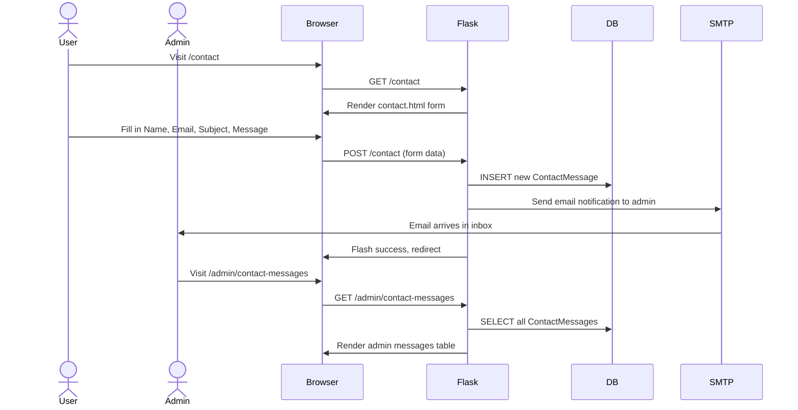

# Contact Us Section — Implementation Plan

## Overview

Add a "Contact Us" section to the Bengali Audio Transcriber Flask application. Users can fill out a contact form that:
1. Stores the message in the SQLite database
2. Sends an email notification to the admin (`niabijoy123@gmail.com`)
3. Is accessible to **all users** (no login required)
4. Appears as a link in **both the nav bar and footer**

Admin users can also view all contact messages from the admin panel.

---

## Architecture & Data Flow



---

## Files to Modify

### 1. [`auth_models.py`](auth_models.py) — Add `ContactMessage` model

Add a new SQLAlchemy model **after** the `LoginLog` class:

```python
class ContactMessage(db.Model):
    __tablename__ = "contact_messages"

    id = db.Column(db.Integer, primary_key=True)
    name = db.Column(db.String(255), nullable=False)
    email = db.Column(db.String(255), nullable=False)
    subject = db.Column(db.String(255), nullable=False, default="")
    message = db.Column(db.Text, nullable=False)
    is_read = db.Column(db.Boolean, default=False, nullable=False)
    created_at = db.Column(db.DateTime, nullable=False, default=_utcnow)
```

### 2. [`requirements.txt`](requirements.txt) — Add Flask-Mail

Append:
```
flask-mail>=0.9.1
```

### 3. [`app.py`](app.py) — Configure Flask-Mail

In the configuration section (around line 20-28), add Flask-Mail config after the existing `MAIL_SERVER` setting:

```python
# --- Mail (SMTP) Configuration ---
app.config["MAIL_SERVER"] = os.getenv("MAIL_SERVER", "smtp.gmail.com")
app.config["MAIL_PORT"] = int(os.getenv("MAIL_PORT", "587"))
app.config["MAIL_USE_TLS"] = os.getenv("MAIL_USE_TLS", "true").lower() in ("true", "1", "yes")
app.config["MAIL_USERNAME"] = os.getenv("MAIL_USERNAME", "")
app.config["MAIL_PASSWORD"] = os.getenv("MAIL_PASSWORD", "")
app.config["MAIL_DEFAULT_SENDER"] = os.getenv("MAIL_DEFAULT_SENDER", "")
```

**Note:** The existing `MAIL_SERVER` config on line 28 can be **removed** since it's now part of the block above.

Import and initialize Mail:
```python
from flask_mail import Mail
mail = Mail(app)
```

Add near the other extension initializations (around line 262-268).

### 4. [`auth_utils.py`](auth_utils.py) — Add `send_contact_notification()`

Add a new function **after** `send_unlock_notification()`:

```python
def send_contact_notification(contact: "ContactMessage") -> None:
    """Send an email to the admin about a new contact message."""
    from flask_mail import Message
    from app import mail

    admin_email = os.getenv("MAIL_USERNAME", "niabijoy123@gmail.com")

    msg = Message(
        subject=f"[Contact Form] {contact.subject or 'No Subject'}",
        recipients=[admin_email],
        reply_to=contact.email,
        body=(
            f"New contact message from {contact.name} ({contact.email})\n\n"
            f"---\n{contact.message}\n---\n\n"
            f"Submitted at: {contact.created_at.strftime('%Y-%m-%d %H:%M:%S UTC')}"
        ),
    )
    try:
        mail.send(msg)
        print(f"[Contact] Email sent to admin from {contact.email}")
    except Exception as e:
        print(f"[Contact] Failed to send email: {e}", file=sys.stderr)
```

Import `os` and `sys` at the top of the file if not already there.

### 5. [`auth_routes.py`](auth_routes.py) — Add contact routes

#### a) Import the new model and utility

Add to the existing imports:
```python
from auth_models import ContactMessage
from auth_utils import send_contact_notification
```

#### b) Add `/contact` route (before the admin routes section)

```python
@auth_bp.route("/contact", methods=["GET", "POST"])
@limiter.limit("3 per hour")  # prevent spam
def contact():
    if request.method == "GET":
        return render_template("contact.html", csrf_token=generate_csrf())

    # POST
    name = request.form.get("name", "").strip()
    email = request.form.get("email", "").strip()
    subject = request.form.get("subject", "").strip()
    message = request.form.get("message", "").strip()

    # Validation
    errors = []
    if not name or len(name) > 255:
        errors.append("Name is required (max 255 characters).")
    if not email or "@" not in email:
        errors.append("A valid email address is required.")
    if not message or len(message) < 10:
        errors.append("Message must be at least 10 characters.")
    if len(subject) > 255:
        errors.append("Subject must be under 255 characters.")

    if errors:
        for err in errors:
            flash(err, "danger")
        return render_template("contact.html", csrf_token=generate_csrf())

    # Save to database
    contact_msg = ContactMessage(
        name=name,
        email=email,
        subject=subject,
        message=message,
        is_read=False,
    )
    db.session.add(contact_msg)
    db.session.commit()

    # Notify admin (non-blocking)
    try:
        send_contact_notification(contact_msg)
    except Exception:
        pass  # non-blocking

    log_action(
        user_id=current_user.id if current_user.is_authenticated else 0,
        action="contact",
        ip_address=request.remote_addr or "",
        details=f"Contact from {name} ({email}): {subject[:100]}",
    )

    flash("Your message has been sent! We'll get back to you shortly.", "success")
    return redirect(url_for("auth.contact"))
```

#### c) Add `/admin/contact-messages` route

```python
@auth_bp.route("/admin/contact-messages")
@login_required
@admin_required
def admin_contact_messages():
    page = request.args.get("page", 1, type=int)
    per_page = 20
    messages_pagination = (
        ContactMessage.query
        .order_by(ContactMessage.created_at.desc())
        .paginate(page=page, per_page=per_page, error_out=False)
    )

    # Mark all fetched messages as read
    for msg in messages_pagination.items:
        if not msg.is_read:
            msg.is_read = True
    db.session.commit()

    return render_template("admin/contact_messages.html", messages=messages_pagination)
```

#### d) Update `admin_dashboard()` to include unread contact message count

Add near the existing stats:
```python
unread_messages = ContactMessage.query.filter_by(is_read=False).count()
```

Add to the render_template call:
```python
unread_messages=unread_messages,
```

### 6. [`templates/contact.html`](templates/contact.html) — New contact form page (NEW FILE)

Create a new template extending `base.html`:

- Use the existing premium design system classes
- Form fields: Name, Email, Subject (optional), Message (textarea)
- CSRF token via hidden input
- Premium card container with glassmorphism
- Responsive layout, matching existing auth form pages

### 7. [`templates/base.html`](templates/base.html) — Add navigation links

#### a) Nav bar — Add "Contact" link available to everyone

Insert before the `` block:
```html
<a href="{{ url_for('auth.contact') }}" class="nav-link">Contact</a>
```

#### b) Nav bar — Add "Messages" link for admin users

Inside the `` block, add after "Logs":
```html
<a href="{{ url_for('auth.admin_contact_messages') }}" class="nav-link">Messages</a>
```

#### c) Footer — Add "Contact Us" link

Update the footer section to include a clickable Contact link alongside the existing Contact phone number.

### 8. [`templates/admin/contact_messages.html`](templates/admin/contact_messages.html) — Admin messages page (NEW FILE)

Create an admin template extending `base.html` that:
- Lists all contact messages in a premium table
- Shows: Name, Email, Subject, Message preview, Date, Status (read/unread)
- Supports pagination using existing premium-pagination classes
- Shows full message in an expandable/details section

### 9. [`templates/admin/dashboard.html`](templates/admin/dashboard.html) — Add unread messages stat

Update the admin dashboard template to show:
- A new stat card for "Unread Messages" count (if the template has a stats grid)

### 10. [`static/css/premium.css`](static/css/premium.css) — Contact form styling (if needed)

The existing premium design system already has:
- `.premium-form-group` for form fields
- `.premium-input` for input styling
- `.premium-textarea` for textarea
- `.premium-btn-primary` for submit button
- `.premium-card` for cards
- `.premium-form-card` for form width constraint

**No additional CSS should be needed** — the contact form will reuse these classes.

---

## Implementation Order

1. **`auth_models.py`** — Add `ContactMessage` model (creates the table)
2. **`requirements.txt`** — Add Flask-Mail dependency
3. **`app.py`** — Configure and initialize Flask-Mail
4. **`auth_utils.py`** — Add `send_contact_notification()` helper
5. **`auth_routes.py`** — Add `/contact` and `/admin/contact-messages` routes; update dashboard stats
6. **`templates/contact.html`** — Create the contact form page
7. **`templates/admin/contact_messages.html`** — Create the admin messages page
8. **`templates/base.html`** — Add Contact/Messages links to nav and footer
9. **`templates/admin/dashboard.html`** — Add unread messages stat card

---

## Configuration (.env)

The user's `.env` already contains the required SMTP settings:

```
MAIL_SERVER=smtp.gmail.com
MAIL_PORT=587
MAIL_USE_TLS=true
MAIL_USERNAME=niabijoy123@gmail.com
MAIL_PASSWORD=niabijoy123
MAIL_DEFAULT_SENDER=niabijoy123@gmail.com
```

**Note:** For Gmail SMTP to work, the user must use an [App Password](https://myaccount.google.com/apppasswords) (requires 2FA enabled) instead of their regular Gmail password.

---

## Database

The `ContactMessage` table will be auto-created by the existing `@app.before_request` -> `create_tables()` mechanism in `app.py`.

---

## Edge Cases & Considerations

| Concern | Handling |
|---------|----------|
| **Spam prevention** | Rate limiter: 3 submissions per hour per IP |
| **Empty submission** | Server-side validation for name, email, message |
| **XSS in message** | Jinja2 auto-escapes HTML by default |
| **SMTP failure** | Non-blocking — message still saved to DB; error logged to console |
| **Long messages** | TEXT field in SQLite has no practical limit |
| **Unicode (Bengali)** | Fully supported by SQLite/UTF-8 and SMTP UTF-8 |
| **CSRF** | Existing Flask-WTF CSRF protection applied |
