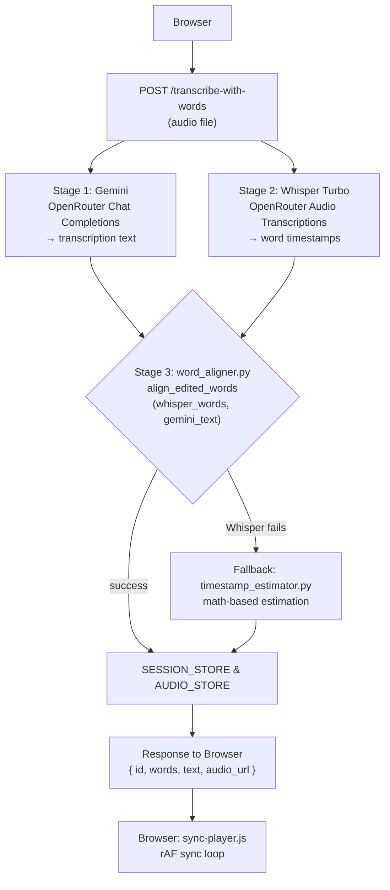
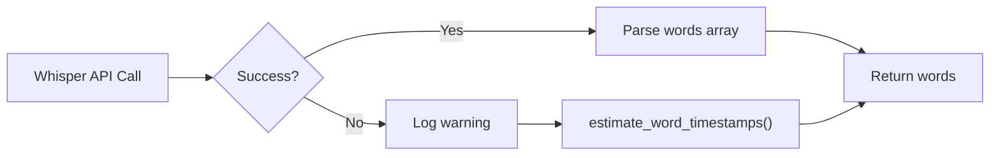

# Hybrid Sync Implementation Plan

## Summary

The codebase already has a working two-stage pipeline using **Gemini + Whisper-1**. The master prompt's core changes are:

1. **Switch models**: `openai/whisper-1` → `openai/whisper-large-v3-turbo`
2. **Switch API format**: multipart/form-data → JSON with base64-encoded audio
3. **Create `timestamp_estimator.py`** as a fallback (currently doesn't exist)
4. **Add graceful degradation**: fall back to estimation when Whisper fails
5. **No frontend changes needed**: words array shape `{word, start, end, index, unchanged}` stays identical

---

## Architecture Flow



---

## Step-by-Step Changes

### Step 1: Create `services/timestamp_estimator.py`

**New file** — acts as a math-based fallback when Whisper API fails.

- Function: `estimate_word_timestamps(text: str, audio_duration: float) -> list[dict]`
- Distributes words uniformly across the audio duration
- Returns `[{word, start, end, index, unchanged}]` with `unchanged: False` for all
- Simple linear distribution: word duration = total_duration / word_count
- No dependencies beyond standard lib

### Step 2: Modify constants in `app.py`

**Changes to `Local LLM/app.py`:**
- `WHISPER_MODEL`: `"openai/whisper-1"` → `"openai/whisper-large-v3-turbo"`
- Add a new constant `WHISPER_TIMESTAMPS_FALLBACK` flag or simply modify the existing code

### Step 3: Rewrite `transcribe_whisper()` in `app.py`

**Change from multipart/form-data to JSON/base64.**

New request body:
```json
{
  "model": "openai/whisper-large-v3-turbo",
  "input_audio": {
    "data": "<base64-encoded audio>",
    "format": "mp3"
  }
}
```

Key changes:
- Remove `tempfile.NamedTemporaryFile` and file-opening logic
- Encode audio bytes to base64 inline
- POST to `https://openrouter.ai/api/v1/audio/transcriptions` with JSON body
- Add `Content-Type: application/json` header
- Parse response for `words` array — handle both top-level `words` and `segments[].words` shapes
- **Discard Whisper's `text` field** — only return the words array

### Step 4: Update `get_whisper_word_timestamps()` in `app.py`

- Simplify since `transcribe_whisper()` will now return just the words array
- Add sequential index numbering (already done)
- Add try/except wrapper that falls back to `timestamp_estimator.py` on failure
- Log a warning when falling back

### Step 5: Update pipeline functions for graceful degradation

**Modify `transcribe_sync_inline()` at line 277:**
- Wrap Whisper call in try/except
- On Whisper failure: get audio duration from existing `get_audio_duration_from_bytes()`, call `estimate_word_timestamps(text, duration)`, log warning
- Continue with alignment using estimated timestamps

**Modify `transcribe_sync_chunked()` at line 309:**
- Same fallback pattern for each chunk
- When falling back in chunked mode, use chunk duration (known from chunking params) for estimation
- Offset adjustment still applies

### Step 6: Verify no frontend changes needed

The words array shape returned to the browser remains:
```json
[{ "word": "...", "start": 0.0, "end": 0.5, "index": 0, "unchanged": true }]
```

`sync-player.js` expects exactly this shape — **no changes needed**.

### Step 7: Verify no config/env changes needed

- `OPENROUTER_API_KEY` is reused — **no new env vars**
- No new pip dependencies — `requests` and `base64` are already in use
- **No changes to `requirements.txt`**

---

## Files Changed Summary

| File | Action | Description |
|---|---|---|
| `services/timestamp_estimator.py` | **Create** | Math-based fallback for word timestamp estimation |
| `app.py` | **Modify** | Switch to whisper-large-v3-turbo, JSON/base64 API, add fallback logic |
| `services/word_aligner.py` | **No change** | Already generic enough for dual use |
| `static/js/sync-player.js` | **No change** | Words shape unchanged |
| `.env` | **No change** | Reuses existing OPENROUTER_API_KEY |
| `requirements.txt` | **No change** | No new dependencies |

---

## Error Handling Strategy



- Whisper 4xx/5xx → catch RuntimeError, log warning, call estimator
- Whisper returns unexpected shape (no `words`) → catch, log, call estimator
- Gemini failure → let the error propagate (same as today)
- Both fail → let the error propagate to the route handler

---

## Verification Steps (from Section 7 of master prompt)

1. ✅ Short audio clip word timestamps line up with playback
2. ✅ Large audio chunk offset handling (already implemented correctly)
3. ✅ Existing `/transcribe` route unchanged
4. ✅ Edit flow (`PUT /api/session-transcriptions/<id>`) reuses same alignment
5. ✅ Whisper failure → fallback to estimation, not crash
6. ✅ Bengali text alignment (Needleman-Wunsch is language-agnostic on word tokens)
7. ✅ Whisper text never shown to user — only timestamps extracted
