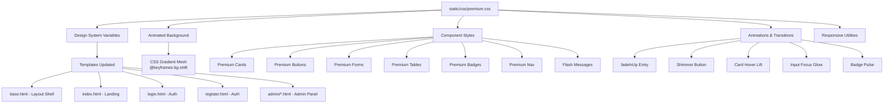

# Premium UI Redesign Plan

## Overview
Transform the current dark-themed site into a **luxury/premium experience** by enhancing the visual design language — refined glassmorphism, elegant typography, micro-interactions, animated backgrounds, and polished components. No Python backend files will be touched.

---

## Design Philosophy

| Aspect | Current | Premium Target |
|--------|---------|---------------|
| **Background** | Static gradient `#0f0c29 → #302b63 → #24243e` | Animated gradient mesh with depth parallax |
| **Glassmorphism** | Basic `backdrop-filter: blur(16px)` | Multi-layered glass with subtle inner glow + border shimmer |
| **Typography** | Basic Inter | Elegant **Playfair Display** (headings) + Inter (body) + JetBrains Mono (code) |
| **Colors** | Purple/Blue only | Violet → Indigo → Emerald with Gold/Champagne accents |
| **Cards** | Flat glass | Elevation hover, glow border, subtle reflection |
| **Buttons** | Gradient, basic hover | Shimmer/ripple effect, glow on hover, micro-bounce |
| **Inputs** | Dark with simple border | Floating labels, animated focus glow, subtle icon |
| **Tables** | Plain dark rows | Striped with hover elevation, better typography |
| **Animations** | None | Entry fade-in, hover micro-interactions, smooth transitions |
| **Scrollbar** | Default | Custom premium scrollbar |

---

## File Structure

```
static/
  css/
    premium.css         # All premium styles (single comprehensive file)
```

All 9 template files updated to reference new CSS classes.

---

## Implementation Steps

### Step 1: Create `static/css/premium.css` (~600 lines)
The heart of the redesign. One comprehensive CSS file covering:

**1.1 Custom Properties & Reset**
- CSS variables for the entire design system
- Smoother box-sizing and base styles

**1.2 Animated Background**
- CSS-only animated gradient mesh (slow-shifting `@keyframes`)
- Subtle radial gradients for depth
- `::before` pseudo-element overlay for texture

**1.3 Premium Typography**
- `@import` Google Fonts: Playfair Display (headings), Inter (body), JetBrains Mono (code)
- Refined heading sizes, letter-spacing, and line-height
- Gradient text for all main headings

**1.4 Navigation Enhancement**
- Better glass nav with bottom border glow
- Active page indicator (sliding underline)
- Hover glow effects on nav links
- Premium badge styling

**1.5 Card Components**
- Multi-layered glassmorphism (background + subtle border glow)
- Hover elevation with `transform: translateY(-2px)`
- Inner shadow for depth
- Subtle border gradient animation on hover
- `.card-premium` class

**1.6 Premium Buttons**
- 3 variants: Primary (gradient), Outline (glass), Ghost
- Shimmer animation on primary button
- Glow effect on hover
- Micro scale on click
- Loading spinner refinement

**1.7 Premium Form Inputs**
- Floating label animation
- Focus glow effect (box-shadow ring)
- Icon support
- Error/valid states with animated borders
- Dark input background with subtle inner glow

**1.8 Premium Tables**
- Header with gradient
- Row hover with glass lift effect
- Alternating row opacity
- Better cell padding and typography
- Responsive scroll with custom scrollbar

**1.9 Badges & Tags**
- Gradient badges with subtle pulse
- Status indicators with dot animations
- Pill-shaped with better font-weight

**1.10 Flash Messages**
- Slide-in animation
- Gradient backgrounds matching severity
- Dismiss button refinement

**1.11 Scrollbar**
- Custom WebKit scrollbar (thin, rounded, themed)

**1.12 Footer**
- Better glass styling
- Social-style link effects

**1.13 Entry Animations**
- `@keyframes fadeInUp`, `fadeIn`, `slideIn`
- Applied to main content sections

**1.14 Responsive**
- Refined breakpoints
- Better mobile spacing

### Step 2: Update `templates/base.html`
- Add `<link rel="stylesheet" href="{{ url_for('static', filename='css/premium.css') }}">`
- Add Google Fonts preconnect/import
- Add `class="premium-body"` to body
- Update nav structure with premium classes
- Update footer with premium classes
- Add container wrapper classes

### Step 3: Update `templates/index.html`
- Remove duplicate styles from ``
- Use premium card classes
- Premium dropzone styling
- Premium transcription output area
- Better button with premium class

### Step 4: Update `templates/login.html` & `register.html`
- Replace inline styles with premium CSS classes
- Premium form card
- Better input styling
- Premium submit button

### Step 5: Update `templates/unlock_request.html` & `unlock_request_sent.html`
- Premium form styling
- Better message card

### Step 6: Update Admin Templates
- `dashboard.html` — premium stat cards, premium table, better config status cards
- `users.html` — premium table, better action buttons
- `logs.html` — premium pagination, premium table with categories
- `unlock_requests.html` — premium sections, better request cards

---

## Visual Design Details

### Color System
```css
--premium-bg-primary: #0a0a1a;
--premium-bg-secondary: #12122a;
--premium-glass-bg: rgba(255, 255, 255, 0.04);
--premium-glass-border: rgba(255, 255, 255, 0.08);
--premium-glass-hover: rgba(255, 255, 255, 0.10);
--premium-accent-violet: #8b5cf6;
--premium-accent-indigo: #6366f1;
--premium-accent-emerald: #10b981;
--premium-accent-gold: #f59e0b;
--premium-text-primary: #f1f5f9;
--premium-text-secondary: #94a3b8;
--premium-text-muted: #475569;
```

### Key Animations
1. **Background Mesh**: `@keyframes bg-shift` — 20s slow pan across gradient stops
2. **Button Shimmer**: `@keyframes shimmer` — 3s infinite diagonal gradient sweep
3. **Card Hover**: `transform: translateY(-4px)` + `box-shadow` glow
4. **Input Focus**: `box-shadow` ring animation expanding outward
5. **Page Entry**: `fadeInUp` 0.6s ease on `.container`
6. **Badge Pulse**: `@keyframes pulse-dot` for status indicators

---

## Architecture Diagram



---

## Files to Modify

| # | File | Changes |
|---|------|---------|
| 1 | **NEW** `static/css/premium.css` | Create comprehensive premium stylesheet |
| 2 | `templates/base.html` | Link CSS, premium body/nav/footer classes |
| 3 | `templates/index.html` | Premium cards, dropzone, result area |
| 4 | `templates/login.html` | Premium form card, inputs, button |
| 5 | `templates/register.html` | Premium form card, inputs, button |
| 6 | `templates/unlock_request.html` | Premium card, form styling |
| 7 | `templates/unlock_request_sent.html` | Premium success card |
| 8 | `templates/admin/dashboard.html` | Premium stat cards, table, config status |
| 9 | `templates/admin/users.html` | Premium table, action buttons |
| 10 | `templates/admin/logs.html` | Premium table, pagination |
| 11 | `templates/admin/unlock_requests.html` | Premium sections, request cards |

---

## Quality Checklist
- [ ] No Python backend files modified
- [ ] All templates load correctly
- [ ] Responsive on mobile (320px+)
- [ ] Dark theme consistency maintained
- [ ] Animations are subtle, not distracting
- [ ] No external JS dependencies required
- [ ] Flash messages remain functional
- [ ] Form submissions work as before
- [ ] Admin panel fully functional
