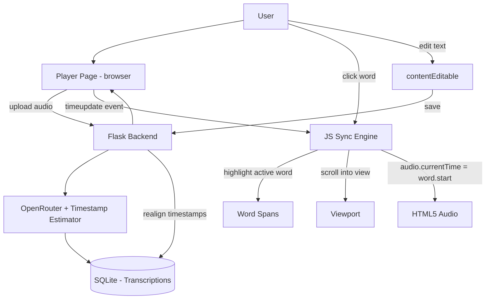
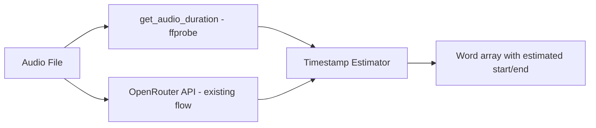
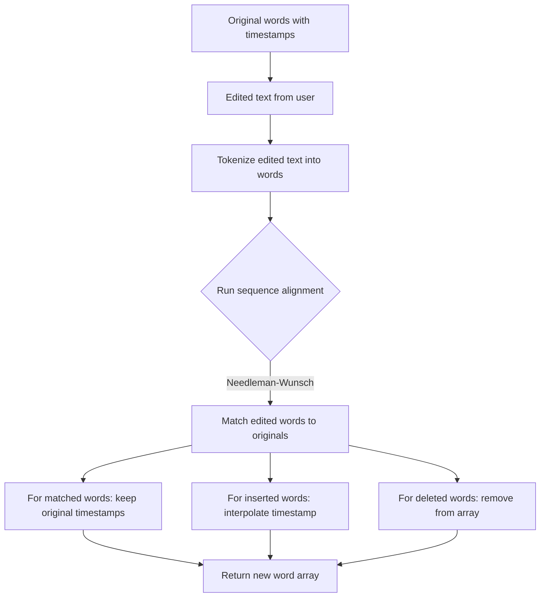

# Sync Transcript Player — Design & Implementation Plan (v2 - OpenRouter + Timestamp Estimation)

## 1. Overview

This feature adds **synchronized audio playback with word-by-word transcript highlighting** to the BM Transcriber application. Users can upload audio, view a synchronized word-level transcript, hear words highlighted in real time as the audio plays, click any word to jump to that position, and edit the transcript text while preserving sync alignment.

---

## 2. System Architecture



---

## 3. Data Model

### 3.1 Database Table: `transcriptions`

Add to [`auth_models.py`](auth_models.py:16) (or a new models file):

| Column | Type | Description |
|--------|------|-------------|
| `id` | Integer PK | Auto-increment primary key |
| `user_id` | Integer FK → users.id | Nullable (for anonymous) |
| `audio_filename` | String(255) | Original uploaded filename |
| `audio_duration` | Float | Total duration in seconds |
| `words_json` | Text (JSON) | `[{"word": "...", "start": 0.0, "end": 0.3}, ...]` |
| `original_text` | Text | Plain text concatenation of all words |
| `edited_text` | Text | Nullable - user's edited version |
| `created_at` | DateTime | UTC timestamp |
| `updated_at` | DateTime | UTC timestamp of last edit |

### 3.2 Word Timestamp Format

```json
[
  {"word": "Hello", "start": 0.0, "end": 0.32, "index": 0},
  {"word": "world", "start": 0.32, "end": 0.65, "index": 1},
  {"word": "this", "start": 0.65, "end": 0.80, "index": 2},
  {"word": "is", "start": 0.80, "end": 0.92, "index": 3},
  {"word": "a", "start": 0.92, "end": 0.98, "index": 4},
  {"word": "test.", "start": 0.98, "end": 1.50, "index": 5}
]
```

Design rationale: Each word has `start` (seconds), `end` (seconds), and a stable `index` used to anchor highlighting and click-to-seek. Even when the text is edited, the original `index` values are preserved for words that remain unchanged.

---

## 4. Backend Components

### 4.1 Timestamp Estimation Service

Create a new file [`services/timestamp_estimator.py`](services/timestamp_estimator.py).

**Approach**: Use the existing OpenRouter transcription pipeline already built in [`app.py`](app.py) combined with audio duration from [`ffprobe`](app.py:125). Since the OpenRouter API does not return word-level timestamps, we estimate them by distributing words proportionally across the audio duration.

#### Estimation Algorithm



**Algorithm details**:

1. **Transcribe**: Use existing `transcribe_inline()` or `transcribe_chunked()` to get plain text
2. **Get duration**: Use existing `get_audio_duration()` via ffprobe
3. **Tokenize**: Split text into words (by whitespace)
4. **Calculate word weights**: Each word's weight = len(word) + punctuation_penalty (periods/comma get extra pause)
5. **Distribute timestamps**:
   - Total weight = sum of all word weights
   - Time per weight unit = duration / total_weight
   - Word_i.start = cumulative weight before word_i × time_per_weight
   - Word_i.end = Word_i.start + (word_i.weight × time_per_weight)

**Punctuation handling**:
- Period `.`, exclamation `!`, question `?` → +50% weight (longer pause)
- Comma `,`, semicolon `;`, colon `:` → +30% weight
- Other punctuation → no adjustment
- This creates natural-looking pauses at sentence/ clause boundaries

**Key function**:
- `estimate_word_timestamps(text: str, duration_sec: float) -> list[dict]` - Returns `[{word, start, end, index}, ...]`

### 4.2 Backend Service — [`services/timestamp_estimator.py`](services/timestamp_estimator.py)

Full implementation:

```python
import re
from typing import TypedDict

class WordTimestamp(TypedDict):
    word: str
    start: float
    end: float
    index: int

def estimate_word_timestamps(text: str, duration_sec: float) -> list[WordTimestamp]:
    """
    Estimate word-level timestamps by distributing words proportionally
    across the audio duration. Handles punctuation to create realistic pauses.
    """
    if not text or duration_sec <= 0:
        return []

    # Tokenize into words (preserve punctuation attached to words)
    tokens = text.split()
    if not tokens:
        return []

    # Calculate weight for each token
    weights = []
    for token in tokens:
        w = len(token)
        # Add weight for sentence-ending punctuation (pauses)
        if token.endswith(('.', '!', '?')):
            w *= 1.5
        elif token.endswith((',', ';', ':')):
            w *= 1.3
        weights.append(max(w, 1))  # minimum weight of 1

    total_weight = sum(weights)
    time_per_weight = duration_sec / total_weight

    words: list[WordTimestamp] = []
    cumulative = 0.0

    for i, (token, weight) in enumerate(zip(tokens, weights)):
        start = cumulative * time_per_weight
        end = (cumulative + weight) * time_per_weight
        # Clamp to duration bounds
        end = min(end, duration_sec)
        words.append({
            "word": token,
            "start": round(start, 3),
            "end": round(end, 3),
            "index": i,
        })
        cumulative += weight

    # Ensure last word ends at duration
    if words:
        words[-1]["end"] = duration_sec

    return words
```

**Design rationale for character-proportional distribution**:
- Longer words naturally take more time to speak → proportional to character count
- Punctuation adds natural pauses between phrases
- No external dependencies needed — pure Python
- Runs instantly, no ML model required
- Works with the existing OpenRouter transcription pipeline

#### a) `POST /transcribe-with-words` — upload & get word-level transcription

**Request**: `multipart/form-data` with `file` (audio file).

**Response** (200):
```json
{
  "id": 1,
  "words": [{"word": "...", "start": 0.0, "end": 0.3, "index": 0}, ...],
  "text": "Hello world this is a test.",
  "duration": 1.5,
  "audio_url": "/uploads/audio_abc123.mp3"
}
```

**Logic**:
1. Validate and save uploaded audio to `uploads/` directory
2. Call `transcribe_with_words()` 
3. Store result in `Transcription` table
4. Return transcription ID and word data

#### b) `GET /player/<transcription_id>` — render the sync player page

Renders [`player.html`](templates/player.html) with word data and audio URL embedded in the page (via a script tag with JSON or a data attribute).

#### c) `GET /api/transcriptions/<id>` — fetch transcription data (JSON)

Returns the full word-level data, text, and audio URL for AJAX loading.

#### d) `PUT /api/transcriptions/<id>` — save edited transcript

**Request**:
```json
{
  "edited_text": "Hello world this is the corrected test."
}
```

**Response** (200):
```json
{
  "id": 1,
  "words": [...re-aligned word timestamps...],
  "text": "Hello world this is the corrected test.",
  "success": true
}
```

**Edit-Realignment Algorithm** (in [`services/word_aligner.py`](services/word_aligner.py)):



The alignment uses approximate string matching to handle minor corrections (spelling fixes) while detecting insertions and deletions.

---

## 5. Frontend Components

### 5.1 Player Page Template — [`templates/player.html`](templates/player.html)

**Layout**:

```
┌─────────────────────────────────────┐
│  [Back to home]                     │
├─────────────────────────────────────┤
│  ┌─────────────────────────────┐    │
│  │  ▶ Audio Player             │    │
│  │  [=======●========] 1:23    │    │
│  │  Speed: 1x ── Waves         │    │
│  └─────────────────────────────┘    │
│                                     │
│  ┌─────────────────────────────┐    │
│  │  [Edit] [Save] [Reset]     │    │
│  ├─────────────────────────────┤    │
│  │                             │    │
│  │  Hello world **this** is a  │    │
│  │  test. This is another      │    │
│  │  sentence.                  │    │
│  │                             │    │
│  └─────────────────────────────┘    │
└─────────────────────────────────────┘
```

### 5.2 Word Rendering Strategy

Each word is rendered as a `<span>` element with:

```html
<span class="word" 
      data-index="0" 
      data-start="0.0" 
      data-end="0.32"
      data-unchanged="true"
      onclick="seekToWord(this)">
  Hello
</span>
```

- `.word` — base styling
- `.word.active` — currently spoken word (highlighted)
- `.word.played` — words that have already been spoken
- `.word.edited` — words that were modified by user
- `.word-inserted` — words added by the user during editing

### 5.3 JavaScript Sync Engine — [`static/js/sync-player.js`](static/js/sync-player.js)

#### Core Algorithm

```javascript
class SyncTranscriptPlayer {
  constructor(audioElement, wordsContainer, words) { ... }

  // Called on audio timeupdate (~4x/sec)
  onTimeUpdate() {
    const currentTime = this.audio.currentTime;
    const activeIndex = this.findActiveWord(currentTime);
    if (activeIndex !== this.lastActiveIndex) {
      this.highlightWord(activeIndex);
      this.scrollToWord(activeIndex);
      this.lastActiveIndex = activeIndex;
    }
  }

  // Binary search for active word by time
  findActiveWord(time) {
    let lo = 0, hi = this.words.length - 1;
    while (lo <= hi) {
      const mid = Math.floor((lo + hi) / 2);
      if (time >= this.words[mid].start && time < this.words[mid].end) return mid;
      if (time < this.words[mid].start) hi = mid - 1;
      else lo = mid + 1;
    }
    // Return nearest word if between words (gap filler logic)
    return Math.max(0, Math.min(lo, this.words.length - 1));
  }

  // Seek audio to word's start time
  seekToWord(index) {
    this.audio.currentTime = this.words[index].start;
    this.highlightWord(index);
  }

  // Toggle edit mode
  toggleEdit() { ... }

  // Save edits to backend
  async saveEdits() { ... }
}
```

#### Key Design Decisions:

1. **Binary Search** over linear scan: Since `timeupdate` fires rapidly, and we may have thousands of words, binary search (O(log n)) is essential over linear scan (O(n)).

2. **Throttle DOM updates**: Only update the DOM when the active word index changes, not on every `timeupdate` event. This prevents layout thrashing.

3. **Scroll behavior**: Use `Element.scrollIntoView({ behavior: 'smooth', block: 'center' })` for the active word to keep it centered in the viewport.

4. **Gap filler logic**: If `currentTime` falls between words (silence/gap), keep the previous word highlighted rather than jumping to the next word prematurely.

### 5.4 Editing System

#### Entering Edit Mode
- User clicks "Edit" button
- Transcript container becomes `contentEditable`
- Words are wrapped in individual `<span>` elements (already are)
- User can type, delete, insert text freely
- "Save" button becomes active, "Edit" becomes "Cancel"

#### Saving Edits
1. User clicks "Save"
2. JS reads the innerText of the transcript container
3. Sends `PUT /api/transcriptions/<id>` with `edited_text`
4. Backend runs word alignment algorithm (Section 4.2.d)
5. Frontend receives updated word array with realigned timestamps
6. DOM is re-rendered with new word spans
7. Sync continues using updated timestamps

#### Maintaining Sync During Edit
- While editing, the audio continues playing and the background sync continues
- Words that haven't been changed maintain their original timestamps
- The active highlight still moves based on audio position using the latest word array
- This is achieved by updating the internal `this.words` array after save

---

## 6. Visual Design & CSS

### 6.1 Word Highlight States

Use CSS custom properties and transitions to create smooth visual feedback:

```css
/* Base word styling */
.sync-word {
  display: inline;
  padding: 0.08em 0.04em;
  border-radius: 4px;
  cursor: pointer;
  transition: background-color 0.15s ease, color 0.15s ease, transform 0.1s ease;
  position: relative;
}

/* Default state - spoken words muted */
.sync-word.played {
  color: var(--p-text-muted);
  opacity: 0.7;
}

/* Active word - bright highlight with glow */
.sync-word.active {
  background: linear-gradient(135deg, var(--p-accent-violet), var(--p-accent-indigo));
  color: #fff;
  transform: scale(1.04);
  box-shadow: 0 0 12px rgba(139, 92, 246, 0.4);
  border-radius: 4px;
  padding: 0.08em 0.12em;
  position: relative;
  z-index: 2;
}

/* Future/unspoken words */
.sync-word.future {
  color: var(--p-text-primary);
  opacity: 1;
}

/* Hover effect */
.sync-word:hover {
  background: rgba(139, 92, 246, 0.15);
  border-radius: 4px;
}

/* Edited words indication */
.sync-word.edited {
  border-bottom: 2px dashed var(--p-accent-gold);
}

/* Inserted words */
.sync-word.inserted {
  border-bottom: 2px dotted var(--p-accent-emerald);
}
```

### 6.2 Audio Player Styling

Custom audio player controls that match the premium dark theme:
- Glassmorphism background
- Violet gradient progress bar
- Smooth transition on seek thumb
- Current time / duration display
- Playback speed selector (0.5x, 1x, 1.25x, 1.5x, 2x)

### 6.3 Transcript Container

- Scrollable container with max-height
- Sticky "now playing" indicator bar at the top
- Smooth scroll behavior
- Line spacing 1.8 for readability
- Font size 1.1rem for comfortable reading

---

## 7. File Structure Changes

```
d:/New folder (3)/New folder/Local LLM/
├── app.py                          # Modified: add new routes
├── auth_models.py                  # Modified: add Transcription model
├── requirements.txt                # Unchanged (no new deps needed)
├── services/
│   ├── __init__.py                 # NEW
│   ├── timestamp_estimator.py      # NEW - estimate word timestamps from duration
│   └── word_aligner.py             # NEW - edit realignment algorithm
├── static/
│   ├── css/
│   │   └── premium.css             # Modified: add sync player styles
│   └── js/
│       └── sync-player.js          # NEW - sync engine + UI controller
├── templates/
│   ├── base.html                   # Unchanged
│   ├── index.html                  # Unchanged
│   └── player.html                 # NEW - sync player page
└── uploads/                        # NEW - stored audio files directory
```

---

## 8. Implementation Order

| Step | File(s) | Description | Dependencies |
|------|---------|-------------|-------------|
| 1 | `services/__init__.py` | Package init | None |
| 2 | `services/timestamp_estimator.py` | Timestamp estimation algorithm | Pure Python |
| 3 | `services/word_aligner.py` | Edit realignment algorithm | Pure Python |
| 4 | `auth_models.py` | Add `Transcription` model | Flask-SQLAlchemy |
| 5 | `app.py` | Add `/transcribe-with-words`, `/player/<id>`, `/api/transcriptions/<id>` endpoints | Steps 1-4 |
| 6 | `templates/player.html` | Player page template | Step 5 |
| 7 | `static/js/sync-player.js` | Sync engine + edit controller | Step 6 |
| 8 | `static/css/premium.css` | Add `.sync-word`, player styles | Steps 6-7 |
| 9 | Integration testing | End-to-end flow verification | All |

---

## 9. Edge Cases & Error Handling

| Scenario | Handling |
|----------|----------|
| **No word timestamps available** | Fall back to uniform distribution: divide audio duration by word count |
| **Audio longer than transcript** | Highlight last word and stay there |
| **User deletes all text** | Show warning "Transcript cannot be empty" |
| **User pastes large text** | Limit to 10,000 words, show warning if exceeded |
| **Audio file not found** | Show "Audio file missing" error with upload retry option |
| **Browser doesn't support audio format** | Show conversion prompt (use ffmpeg) |
| **Rapid seeking** | Debounce the `seekToWord` calls to prevent stuttering |
| **Editing during playback** | Sync continues with best-effort highlighting; saved edits update word array |

---

## 10. Future Enhancements

- **Multi-language support**: Handle RTL scripts in word alignment
- **Speaker diarization**: Color-code words by speaker
- **Waveform visualization**: Add clickable waveform below audio player
- **Keyboard shortcuts**: Space for play/pause, left/right arrows for fine seeking
- **Auto-scroll toggle**: User preference to enable/disable auto-scrolling
- **Export formats**: SRT/VTT subtitle export with word-level timing

---

## 11. Technology Choices & Rationale

| Choice | Option | Rationale |
|--------|--------|-----------|
| **Timestamp Source** | Character-proportional estimation via OpenRouter text + ffprobe duration | No new dependencies; leverages existing pipeline |
| **Word alignment** | Needleman-Wunsch sequence alignment | O(n*m) complexity is fine for text; handles insertions/deletions/substitutions |
| **Frontend** | Vanilla JS (no framework) | Single-page feature; keeps bundle small; no additional dependencies |
| **Audio storage** | Local filesystem (`uploads/`) | Simple; audio files are transient; can migrate to S3 later |
| **Playback** | HTML5 `<audio>` element | Ubiquitous browser support; sufficient for audio-only |
