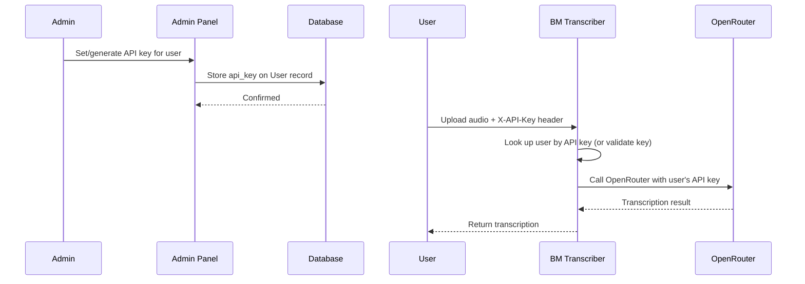

# Plan: User API Key Management System

## Overview

Admins can assign real OpenRouter API keys to individual users. Users send their key via `X-API-Key` header when transcribing, and the backend uses that key to call OpenRouter (instead of the server's key from `.env`).

---

## Architecture Flow



---

## Changes Required

### 1. Database Model — [`auth_models.py`](auth_models.py)

Add an `api_key` column to the `User` model:

| Column | Type | Constraints |
|--------|------|-------------|
| `api_key` | `db.String(255)` | `nullable=True, default=""` |

```python
class User(UserMixin, db.Model):
    # ... existing columns ...
    api_key = db.Column(db.String(255), nullable=False, default="")
```

### 2. Admin Route: Set API Key — [`auth_routes.py`](auth_routes.py)

New route: `POST /admin/users/<int:user_id>/set-api-key`

- `@login_required` + `@admin_required`
- Accepts `api_key` from form field
- Updates `user.api_key`
- Logs the action
- Redirects back to admin users page

Add this after the existing `admin_unlock_user` route (around line 413):

```python
@auth_bp.route("/admin/users/<int:user_id>/set-api-key", methods=["POST"])
@login_required
@admin_required
def admin_set_user_api_key(user_id: int):
    user = db.session.get(User, user_id)
    if not user:
        flash("User not found.", "danger")
        return redirect(url_for("auth.admin_users"))

    new_key = request.form.get("api_key", "").strip()
    user.api_key = new_key
    db.session.commit()

    log_action(
        user_id=user.id,
        action="api_key_updated",
        ip_address=request.remote_addr or "",
        details=f"API key set by admin {current_user.email}",
    )

    if new_key:
        flash(f"API key set for {user.email}.", "success")
    else:
        flash(f"API key cleared for {user.email}.", "info")
    return redirect(url_for("auth.admin_users"))
```

### 3. User Route: Profile Page — [`auth_routes.py`](auth_routes.py)

New route: `GET /profile`

- `@login_required`
- Shows the user their assigned API key (masked reveal)

```python
@auth_bp.route("/profile")
@login_required
def profile():
    return render_template("profile.html")
```

Add a "Profile" link in the navbar for logged-in users in [`templates/base.html`](templates/base.html).

### 4. Template: Admin Users Page — [`templates/admin/users.html`](templates/admin/users.html)

Add a new column **"API Key"** with:
- Masked display of the key (first 8 chars + `...` + last 4 chars)
- A form with an input field + "Set" button to assign/update the key
- A "Generate" button that fills in a random key (UUID-based or lets admin paste one)

Also need to add a route to serve this form.

### 5. Template: User Profile Page — `templates/profile.html` (NEW)

New page showing:
- User email
- Assigned API key (with copy button and reveal/hide toggle)
- Link back to home

### 6. Navbar Update — [`templates/base.html`](templates/base.html)

Add a "Profile" link in the authenticated user section.

### 7. Transcription Logic — [`app.py`](app.py)

Update the `transcribe()` endpoint to:

1. Check for `X-API-Key` header in the request
2. If present:
   - Look up the user by that API key
   - If found, use that key (the user's own OpenRouter key) to call OpenRouter
   - If not found, return 401 Unauthorized
3. If absent:
   - Fall back to server's `OPENROUTER_API_KEY` from `.env` (admin via web UI)

```python
@app.route("/transcribe", methods=["POST"])
def transcribe():
    # --- API key resolution ---
    user_api_key = request.headers.get("X-API-Key", "").strip()
    
    if user_api_key:
        # User provided their own API key — use it directly
        api_key = user_api_key
    else:
        # Fall back to server key (admin via web UI)
        api_key = os.getenv("OPENROUTER_API_KEY", "").strip()
        if not api_key:
            return jsonify({"error": "Server API key not configured"}), 500

    # ... rest of the logic (file validation, format detection, etc.) ...
```

---

## Summary of Files to Modify/Create

| File | Action | Changes |
|------|--------|---------|
| [`auth_models.py`](auth_models.py) | Modify | Add `api_key` column to `User` model |
| [`auth_routes.py`](auth_routes.py) | Modify | Add `admin_set_user_api_key()` and `profile()` routes |
| [`templates/admin/users.html`](templates/admin/users.html) | Modify | Add API Key column with set/generate UI |
| `templates/profile.html` | **Create** | User profile page showing their API key |
| [`templates/base.html`](templates/base.html) | Modify | Add "Profile" nav link for logged-in users |
| [`app.py`](app.py) | Modify | Update `transcribe()` to accept `X-API-Key` header |

---

## Implementation Order

1. Add `api_key` column to `User` model in [`auth_models.py`](auth_models.py)
2. Add admin route to set API key in [`auth_routes.py`](auth_routes.py)
3. Add user profile route in [`auth_routes.py`](auth_routes.py)
4. Update [`templates/admin/users.html`](templates/admin/users.html) with API key management UI
5. Create `templates/profile.html` for users to view their key
6. Add "Profile" nav link in [`templates/base.html`](templates/base.html)
7. Update [`app.py`](app.py) `transcribe()` to check `X-API-Key` header
8. Run DB migration (drop/create or manually add column)
